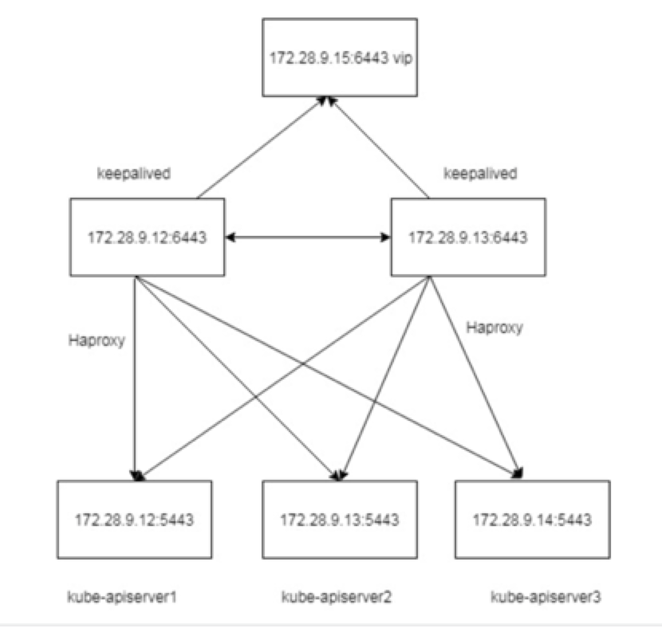

# K8S 实践

首先，我们拿到一个 case 的时候，优先考虑的是业务类型以及业务规模；只有大致确定了业务的类型和规模后，我们才可以根据业务类型确定集群规模和集群的兼容（容忍）性。

比如，针对电商业务，需要有大促的突发流量；比如针对流媒体视频处理，考虑的是视频的渲染计算和存储；又比如传统媒体行业如维基百科，没有太多突发的流量，有的只是文本,图片的静态化，CDN 缓存处理；所以，不同的业务类型所考虑的东西不同，但是，k8s 作为一个主流的容器调度平台，云原生时代的操作系统，他是一个通用化的平台，有一个比较通用的实践方式，有了通用的实际方式以后，企业内部只需要针对内部具体的业务特点做定制化处理就可以了。

企业内部如果要自建 k8s 集群的话，有很多地方需要考虑，但是总结下来，主要是计算（cpu/gpu/内存），存储，网络，以及与其他业务交互(主要是业务架构)等几个方面，以及构建后自身的监控，告警，日常运维保障（sre）。

# 网络规划

在企业内部或者云上构建一个集群的时候，摆在第一位的就是网络的规划，类似于想致富先修路，要先有基础网络。在 k8s 集群中有三种网络类型：节点网络，容器网络，服务网络。

企业内部一般有自己的网管，有自己的专用 VPC 网络（大类局域网），我们网络的一切都是从他开始。

### VPC 网段和三种网络类型

在创建 Kubernetes 集群时，需要指定专有网络 VPC、节点交换机网段、Pod 网络 CIDR（地址段）和 Service CIDR（地址段）。因此需要提前规划节点网络地址、Kubernetes Pod 地址和 Service 地址。

专有网络 VPC 网段包含 VPC 自身网段和节点交换机网段，Kubernetes 网段规划包含 Pod 地址段和 Service 地址段，以上两种网段是通过 cni 实现的，不同的 CNI 模式，会有一些差异，我们以 Flannel 网络模式为例子（其他 cni 网络模式原理类似）。

配置 Flannel 模式网络时 ，需要设置的参数及参数网段配置的注意事项如下：

- 专有网络

  您在创建 VPC 时需要选择网段，只能从 10.0.0.0/8、172.16.0.0/12、192.168.0.0/16 三类私有保留网段当中选择一个（公司内部直接就选择一个地址空闲地址网络区间）。

- 节点网络交换机

  节点网络（一般构建在同一个交换机网段下），用于节点间网络通信。在 VPC 里创建交换机时指定的网段，必须是当前 VPC 网段的子集（可以和 VPC 网段一样，但不能超过）。配置网段时，请注意：

  - 交换机下 vm（或者物理机）所分配到的地址，就是从这个交换机网段内获取的。
  - 一个 VPC 下，可以创建多个交换机，但交换机网段不能重叠。

- Pod 网络 CIDR

  Pod 网络 CIDR，Pod 地址从该地址段分配，用于 Pod 网络通信。Pod 是 Kubernetes 内的概念，每个 Pod 具有一个 IP 地址。配置网段时，请注意：

  - 该地址段不能和节点网段重叠。
  - 该地址段不能和**Service CIDR**网段重叠。

- Service CIDR

  Service 地址段。Service 是 Kubernetes 内的概念，对应的是 Service 类型为 ClusterIP 时 Service 使用的地址，每个 Service 有自己的地址。配置网段时，请注意：

  - Service 地址只在 Kubernetes 集群内使用，不能在集群外使用。
  - Service 地址段不能和 节点网络地址段重叠。
  - Service 地址段不能和 **Pod 网络 CIDR** 地址段重叠。

> 注意点：

- 这里的关键就是本身三者相互不能冲突；
- 以及不要和其他业务有重叠（如果涉及到其他敏感业务甚至需要做防火墙或者逻辑隔离，防止流量串流）；
- 另外地址段要足够，便于日后可见的扩展；

另外说明一下有的业务需要多个可用区（az，一般指多个机房，物理隔离的不会两者同时挂掉）；这个主要是这对大型互联网厂商；

在企业内部首先需要根据业务场景、集群规模进行网络规划。您可以按下表规格进行规划（未包含场景，请根据实际需要自行调整）。

| 集群节点规模              | 目的                                                                                      | VPC 规划 | 可用区                                  |
| :------------------------ | :---------------------------------------------------------------------------------------- | :------- | :-------------------------------------- |
| 小于 100 个节点（非定死） | 一般性业务                                                                                | 单 VPC   | 1 个                                    |
| 任意                      | 需要多可用区                                                                              | 单 VPC   | 2 个及以上 （**一般作为容灾用，多活**） |
| 任意                      | **对可靠性有极致要求、需要多地域（指的是多 region，比如华南机房，华北机房，南北各一个）** | 多 VPC   | 2 个及以上 （\*\*一般作为容灾用，多活） |

注意点：

**针对不同的场景区别还是蛮大的，有的金融系统需要多活容灾，需要考虑的东西特别多；但是我们政府交通，公安系统可以忽略；只需要一个大的 vpc 网络就可以了；**

在企业内实施就是多划分一个 vpc 的大段网络；便于继续构建多套 k8s 集群或者业务数据集群;（容灾或者实际业务有多套需求）。只要网络是打通路由的，内网的路由延时基本可以忽略的；一般内部系统并不会这样做；以上主要是针对的云上。

### 节点网络

节点网络只需要在 vpc 下面划分一个或者多个交换机，给足地址就可以了；不要和 pod、svc 冲突；且预留数目合理，针对我们的省厅应该不会超过 256，给一个 c 段的交换机基本就可以了。

### 容器网络

本文针对 Flannel

- Flannel 配置示例

  | 专有网络网段   | 虚拟交换机网段 | Pod 网络 CIDR 网段 | Service CIDR 网段 | 最大可分配 Pod 地址数 |
  | :------------- | :------------- | :----------------- | :---------------- | :-------------------- |
  | 192.168.0.0/16 | 192.168.0.0/24 | 172.20.0.0/16      | 172.21.0.0/20     | 65536                 |

比如上面可以 有 256 个节点；每个几点有 256 个 pod ip ;总共有 2 的 16 次方个 pod IP

service cidr /20 可以分配 4096 个服务；

**这个对应省厅应该是足够了** 【**附注，在我们的实验室环境大概看到了不到 50 个有效负载，不超过 80 个有效的 svc】**

以上网段可以 ABC 类私有地址均可以；

### SVC 网络

因为内部的 svc 网段是集群内部的流量；外网流量是进不来的；所以这个地址只要不和其他 pod/节点网段冲突，就基本可以了。

Eg: service cidr /20 可以分配 4096 个服务； （见上图表）

### 如何选择地址段

- 场景 1：单 VPC+单 Kubernetes 集群 【**我们应该只需要考虑这样的一种情况**】

  这是最简单的情形。VPC 地址在创建 VPC 的时候就已经确定，创建 Kubernetes 集群时，选择的 Pod 及 Service 地址网段和当前 VPC 不一样的地址段即可。

  **我们应该只需要考虑这样的一种情况**

- 场景 2：单 VPC+多 Kubernetes 集群

  一个 VPC 下创建多个 Kubernetes 集群。

  - VPC 地址是在创建 VPC 时已经确定。创建 Kubernetes 集群时，每个集群内的 VPC 地址段、Service 地址段和 Pod 地址段彼此间不能重叠。
  - **所有 Kubernetes 集群之间的 Pod 地址段不能重叠，但 Service 地址段可以重叠** （**因为 service 是内部通信，跨集群是透明的**）。
  - 在默认的网络模式下（Flannel），Pod 的报文需要通过 VPC 路由转发，容器服务会自动在 VPC 路由上配置到每个 Pod 地址段的路由表。

  **说明** 这种情况下 Kubernetes 集群部分互通，一个集群的 Pod 可以直接访问另外一个集群的 Pod 和节点 （只要网络层面打通），但不能访问另外一个集群的 Service。 **【即使网络打通的情况，因为 svc 是一个虚拟的地址】**

- 场景 3：VPC 互联

  两个 VPC 网络互联的情况下，可以通过路由表配置哪些报文要发送到对端 VPC 里。如下表所示，VPC 1 使用地址段 192.168.0.0/16，VPC 2 使用地址段 172.16.0.0/12，您可以通过路由表，指定在 VPC 1 里把目的地址为 172.16.0.0/12 的报文都发送到 VPC 2。

  

  | 类别  | 地址段         | 目的端         | 转发到 |
  | :---- | :------------- | :------------- | :----- |
  | VPC 1 | 192.168.0.0/16 | 172.16.0.0/12  | VPC 2  |
  | VPC 2 | 172.16.0.0/12  | 192.168.0.0/16 | VPC 1  |

  在这种情况下，VPC 1 和 VPC 2 里创建的 Kubernetes 集群有以下限制：

  - 不能和 VPC 1 的地址段重叠
  - 不能和 VPC 2 的地址段重叠
  - 不能和其他集群的地址段重叠
  - 不能和 Pod 的地址段重叠
  - 不能和 Service 的地址段重叠

  此例子中，Kubernetes 集群 Pod 地址段可以选择 10.0.0.0/8 下的某个子段。

  **说明** 您需特别关注转发到 VPC 2 的地址段，可以把这部分地址理解成已经占用的地址，Kubernetes 集群不能和已经占用的地址重叠。

  如果 VPC 2 里要访问 VPC 1 的 Kubernetes Pod，则需要在 VPC 2 里配置到 VPC 1 Kubernetes 集群 Pod 地址的路由。

# 计算资源规划

计算资源主要是针对控制面节点和计算节点的 cpu/mem 的资源的使用做一个评估和分配；（针对 gpu 类型的计算资源的话，同理）；

### 控制面计算资源

Master 节点上运行着 etcd（存储）、kube-apiserver（总控网关）、kube-controller-manager（控制器组）,kube-scheduler(调度)等核心组件，对于 Kubernetes 集群的稳定性有着至关重要的影响，对于生产环境的集群，必须慎重选择 Master 规格。Master 规格跟集群规模有关，集群规模越大，所需要的 Master 规格也越高。

**说明:** 可从多个角度衡量集群规模，例如节点数量、Pod 数量、部署频率、访问量。(经验数据)

| 集群规模    | 控制面 apiserver<br />scheduler<br />controller-manager | 节点数目 | 节点配置         | etcd 是否单独节点部署 | etcd 节点数 | Etcd 是否 ssd 磁盘 | etcd 节点配置   | dns 是否单独部署 | dns 副本数目 | dns 节点配置    | prometheus 是否单独部署 | prometheus 副本数目 | prometheus 节点配置 | ingress | 是否单独 | ingress 节点配置(这个需要针对具体入网流量来合理分配实例可以满足我们的系统) | Pod 网对端【针对 flannel】     | 备注 | 机器总数 | Cpu/mem   |
| ----------- | ------------------------------------------------------- | -------- | ---------------- | --------------------- | ----------- | ------------------ | --------------- | ---------------- | ------------ | --------------- | ----------------------- | ------------------- | ------------------- | ------- | -------- | -------------------------------------------------------------------------- | ------------------------------ | ---- | -------- | --------- |
| (0-20)      | 3                                                       | 3        | 8core 16g 300g   | 否                    | 3           | 否                 | -               | 否               | 2            | -               | 否                      | 2                   | 8core 16g           | 2       | 否       | 4core/8g                                                                   | pod 网段容量 1 个 b 类/16 掩码 |      | 3        | 24c/48g   |
| [20 50)     | 3                                                       | 3        | 16core 32g 500g  | 是                    | 3           | 是                 | 8core 16g 300g  | 是               | 2            | 8core 16g 300g  | 是                      | 2                   | 32core 64g          | 3       | 是       | 8core/16g                                                                  | pod 网段容量 1 个 b 类/16 掩码 |      | 13       | 176c/352g |
| [50,256)    | 3                                                       | 3        | 32core 64g 500g  | 是                    | 3           | 是                 | 16core 32g 300g | 是               | 2            | 16core 32g 300g | 是                      | 2                   | 32core 64g          | 4       | 是       | 16core 32g                                                                 | pod 网段容量 1 个 b 类/16 掩码 |      | 14       | 216c/464g |
| [256,1000)  | 3                                                       | 3        | 32core 64g 500g  | 是                    | 3/5         | 是                 | 16core 32g 300g | 是               | 3            | 16core 32g 300g | 是                      | 3                   | 64core 128g         | 4       | 是       | 16core 32g                                                                 | pod 网段容量 4 个 b 类/16 掩码 |      | 16/18    |           |
| [1000,2000) | 3                                                       | 3        | 64core 128g 500g | 是                    | 3/5         | 是                 | 16core 32g 300g | 是               | 3            | 16core 32g 300g | 是                      | 3                   | 64core 128g         | 4       | 是       | 32core 64g                                                                 | pod 网段容量 8 个 b 类/16 掩码 |      | 16/18    |           |

- 基于稳定性考虑，我们一般建议 etcd 和控制面组件分开部署，对于测试环境，规格可以比表格稍小一些。
- Pod 网络 CIDR 不能设置太小，如果太小，可支持的节点数量就会受限。这个值的设置需要与节点 Pod 数量\*\*综合考虑。例如：Pod 网络 CIDR 的网段是/16，那么就有 256x256 个地址，如果每个节点 Pod 数量是 128，则最多可以支持 512 个节点。需要针对不同的 cni 插件看分配情况。
- 部署 CoreDNS 副本时，将 CoreDNS 副本打散在不同可用区、不同集群节点上，避免单节点、单可用区故障。CoreDNS 默认配置了按节点的弱反亲和性，可能会因为节点资源不足导致部分或全部副本部署在同一节点上，如果遇到这种情况，请删除 Pod 重新触发其调度来调整,我们只需要多副本就可以了。

  CoreDNS 所运行的集群节点应避免 CPU、内存用满的情况，否则会影响域名解析的 QPS 和响应延迟。

- prometheus 数据要存储多久，如果存储时间大于 15 天；如果后面需要存储拉取的数据查询大于 15 天，可能要选用 victormetrics 做高可用（可以水平扩展，高可用，内存使用率小）；

  ## Ingress Controller

  在部署 Nginx Ingress Controller 时，请确保 Nginx Ingress Controller 分布在不同的节点上，避免不同 Nginx Ingress Controller 之间资源的抢占和单点故障。您也可以为其使用独占节点来保证性能与稳定性。

  好处：

  - 因为 ingress 控制器是采用的 ds 部署的，随着节点规模变大，浪费验证没有必要每一个都部署；节约成本。
  - 专用可以不用设置 request/limits 可以 跑满，不会因为有 oom 的情况 【专用，利用率高】；
  - 注意这个需要根据流量具体配置做一个调整，因为这个是和流量强依赖的；针对我们的系统上面的配置基本够了。
  - **如果业务需要可以针对不同的业务可以分散流量；大流量的专门划分一组 Ingress 节点；前面挂载一个高配置的 NGINX 做负载均衡；当然普通的流量入口也可以挂载一个 LB 作为 ingress 流量的入口。（从这里可以入手之前说的双网卡的流量问题）**

### 部署方式

| 控制面组件              | 部署方式               | 备注 |
| ----------------------- | ---------------------- | ---- |
| Etcd                    | 二进制/静态 pod/docker |      |
| Kube-apiserver          | 二进制/静态 pod/docker |      |
| Kube-controller-manager | 二进制/静态 pod/docker |      |
| Kube-scheduler          | 二进制/静态 pod/docker |      |

在企业内部我们还可以选择一个探活 vip 和 haproxy 做四层的转发；




etcd 奇数副本的 Raft 选举的高可用集群，一般用 3 个节点，在节点数目较大的时候可以用 5 个节点做集群；

> 问题

- etcd 社区 v3.4.3 版本允许写入 100 GB 的 etcd 存储，可以解决 etcd 存储不足的问题
- etcd 版本是社区 v3.3.8，其支持的最大 Backend DB Size 是 2 GB
- 对应一个发布不频繁的中小规模集群（<= 200 个 node）足够用了;
- 高本版的 etcd raft 协议有所调整，除了 fowller,leader，还有一个 Learner 的学习者。
- etcd 数据 wal 和同步的时候对磁盘性能要求较高，建议选用 ssd 的；否则有可数据同步会有 slow 的情况；影响健康检查，某些情况会频繁选举，影响集群稳定性。

### 计算节点资源

通用的原则：

创建 k8s 集群时，我们尽量使用规格较大的机器，因为使用大规格物理机或者 VM 的比使用小规模的 node 有如下优势：

- 拉取镜像的效率更高。因为镜像只需要拉取一次就可以被多个容器使用。而对于小规格的节点拉取镜像的次数就会增多；
- 集群规模节点数缩小

但是，也不建议使用特别大的物理机，主要是怕该机器宕机后，由于在上面部署的容器太多，导致影响面太广，一般机器上面部署的 app 不超过 20 个 pod。

### 资源预估

- 对 VM 的分配，首先要预估服务的资源；一般预留系统资源 10-20%（os 系统本身的进程使用）；

  举例： 如果以 20%的为例，我们的应用需要 800core 的话，我们物理机或者 vm 的资源要给到 1000core;

  另外 ，还要考虑机器故障率，确定整个集群的日常使用的总核数以及可用度的容忍度，就是运行一部分机器可能存在挂掉的情况；（比如硬件故障或者服务流量等的故障，导致 node 出现异常），一般 10%左右。

  举例，仍然以上面的例子说明，如果应用需要 800core 的话，实际上，如果有 10%的故障容忍度，需要多出来 80core,结合上面也就是我们需要的资源 约 1080core。

- 确定 CPU：Memory 比例。对于使用内存比较多的应用例如 Java 类应用，建议考虑使用 1:8 的机型。
- 根据应用类型划分不同的比例 比如 Java 类型 1：2，1：4，1：6 机型，或者如果为了节约资源甚至可以共享专用该机器（不设置具体的 Request/limits,大家抢占，一般针对小规模的应用）

这对开发 app cpu/mem 资源的评估。

1. 有两个方案，一个是开发预估；
2. 另外就是在压测的时候看水位，决定需要分配的比例，或者看历史的 dashbord 看数据。
3. 如果还不够的话可以设置 HPA；
4. 尽量在第一第二的时候给到一个比较合理的数字。

### 物理裸金属服务器

- 交通或者公安系统机房空间有限，使用较高配置的物理裸金属机器，便于管理；否则低配的节点较多。
- 安装部署的时候不需要在做虚拟化；省掉一部分工作；
- 根据我们的业务需求，计算节点应该可以使用物理机；比 1000 路渲染算法；这样的数据更佳，集群规模也甚至可以控制在 20 台左右，比如物理机 80core 的裸金属，20-30 台规模就可以达到 1600-2400core 的规模；
- 问题，怕一个机器上面 pod 太多，一个挂掉影响面广阔。

### 磁盘类型及大小

磁盘类型

- 推荐选择 SSD 盘，针对大量写日志的 app,如果没有普通的 hdd 也行；但是 etcd 生产环境一定要选择 ssd 的(高 io 型的)。
- 磁盘大小

  Kubernetes 节点需要的磁盘空间也不小， （挂载路径不要挂载系统根分区）

  Docker 镜像、系统日志、应用日志都保存在磁盘上。

  创建 Kubernetes 集群的时候，要考虑每个节点上要部署的 Pod 数量，每个 Pod 的日志大小、镜像大小、临时数据，再加上一些系统预留的值，

  一般选择 800g 以上；【便于存储日志】；可以调整；

  Docker 注意数据路径不要写在根目录；避免后续镜像过多导致根磁盘容量不够的问题。

# 存储

1. local 存储
2. nfs 存储
3. ceph 存储 rbd
4. 线上云存储 【私有集群】

不同的存储类型需要有对应的 provisioner 驱动；

我们的日志主要是本地直接在 K8s 中通过 volume 挂载在本地目录；（需要指定节点部署）

其他的视频存储通过云上是 storageclass 驱动挂载云上。

针对 k8s 的组件，比如 Prometheus 可以在本地 Local-storage 存储，grafana 的数据一样。

# 关联的中间件

1. 部署

   - 就近原则 （同 Az，同机房）使得网络 latecy 尽量小；因为有的业务对时延非常高，不同 az 会有 3-5ms 的延时
   - 对于 mysql/pg/redis/tidb/zookeeper/kafka 尽量采用非容器部署，稳定性和性能有保证；
   - 个别组件如果做不到，要做好持久化。
   - 服务之间的交互方式，是 rest 的还是 rpc；可以做链路追踪 APM（skywalking ）

2. 中间件要做到 HA
3. 监控，告警 （统一挂接到 prometheus 上去）
4. 备份 不同的组件可能需要 专业的 dba 处理

   这里是比较重要的，现在的 dba 是怎么处理的？ 不同的数据库玩法不一样,关系型和非关系型玩法各不相同， 高可用要求比较高；我目前对这一块的数据库的高可用不太熟悉,需要研究。

# 命名规范

通用的主机规范可以根据具体业务情况来区分，便于管理。

一种可能的方式，eg： [root@prod.op.k8s.etcd-04.hz ops]# ；进入机器后展现方式是 用户@命名方式 目录这样的结构，可以通过自定义环境变量实现。
这里主要说的是主机命名

1. 第一个字段是环境（dev,prod,test），比如针对内部的实验室环境第一个字段可以是 dev,exp(experiment 的简写)
2. 第二个字段是 团队，部门，业务的组织架构，比如湘潭交通，可以写 traffic ,公安系统可以是 police，我们内部实验室就可以写 op（运维）
3. 第三个字段 表示所属领域或者基础组件名称，比如 各个中间的名称，k8s,mysql,postgress，kafka,zookeeper,redis 等。
4. 第四个字段表示具体领域的业务 application 名称 【etcd ,logcenter,searchimage,gelin 等】
5. 第五个字段表示具体机器的序号，因为一般会是集群，用 00 开头，依次是 01，02 等；
6. 代表业务归属地，比如湘潭时 可以 .xtcity xiangtan 市首字母, 如果是省，就用比如江苏省厅的业务就 .jsprovince ;
7. 中间串联的字符一定要用点. 表示，其他字符不允许。

这个主要是针对集群规模较大的情况，如果只是针对 k8s，可以简单一点；

master 节点就是 [root@prod.op.k8s.master-00.hz ops ]

非 gpu node 可以是 [root@prod.op.k8s.node-00.hz ops]

Gpu node 可以是 [root@prod.op.k8s.gpu-00.hz ops]

专用节点的话 可以是 [root@prod.op.k8s.dns-00.hz ops] , [root@prod.op.k8s.prometheus-00.hz ops] 等；

# 运维

## 镜像仓库

1. 镜像封装

   1. 安装在 vm 上的原生的 os
   2. k8s 上应用运行拉取的镜像的最开始的基础镜像包
   3. 指定 常用的挂载路径，便于收集日志，以后也好统一清理；eg: /opt /home/ /home/zxw
   4. 指定非 Root 用户，操作需要切换到 root; 【我们暂可以不采用】

2. 镜像的常用工具链

   - 统一 java jdk 工具链版本,小版本 和厂商，eg: OpenJDKxxx
   - 网络组件
   - ```
     vim curl wget unzip ntpdate net-tools ipvsadm ipset sysstat conntrack libseccomp
     jq git tcpdump gcc,gdb,netstat, tar, unzip, zip ,

     openssl openssl-devel 　  #openssl
     pcre pcre-devel　　　　 #pcre库，是很多软件的依赖
     telnet　　　　　　　　 #telent工具，通常用来测试端口是否通
     setuptool 　　　　　　 #一组Python的 distutilsde工具的增强工具，easy_install是包里带的一个命令
     ntsysv 　　　　　　　　 #ntsysv命令用于互动式设置系统的各种服务
     git 　　　　　　　　　　 #git工具
     python-urllib3　　　　　　 #用于HTTP客户端的Python库
     gcc gcc-c++　 gdb　　　#C语言编译器，很多包的编译依赖
     cmake　　　　　　　　 #make工具
     lsof 　　　　　　　　 #列出当前系统打开文件的工具
     sysstat　　　　　　　　 #一个软件包，包含监测系统性能及效率的一组工具，例如iostat
     bind-utils 　　　　　　 #DNS工具包，包含nslookup，dig等
     ntpd  ntpdate 　　　　　　 #时间同步
     iftop 　　　　　　　　 #流量查看工具
     iotop 　　　　　　　　 #IO查看工具
     tree 　　　　　　　　　　 #树状目录
     dstat 是一个可以非常灵活使用和进行组合使用的工具，它可用于监控内存、进行、网络及磁盘性能
     ss 全称 socket statistics，是一个可以替代 netstat 的网络连接查看工具
     nvidia-smi gpu 工具链；
     lsof
     telnet
     nc
     ss
     lrzsz
     Nmon 是一个可以监控当前系统性能的小工具


     编译环境基础镜像：
     x86:
     gcc 4.8
     gcc 5.4

     arm:
     gcc 4.8
     gcc 5.4

     运行环境：
     gdb , perf , 【环境变量】

     gcc version 4.8.5 20150623 (Red Hat 4.8.5-44) (GCC)
     [viid@viid ~]$ perf -v
     perf version 4.14.49.el7a.aarch64.debug.g5bb38


     java:
     x86:
     oracle  1.8.0_152

     [root@commonapi-commonapi-vsap-54b469c8d-w4tg6 video]# java -version
     java version "1.8.0_152"
     Java(TM) SE Runtime Environment (build 1.8.0_152-b16)
     Java HotSpot(TM) 64-Bit Server VM (build 25.152-b16, mixed mode)


     arm:
     OpenJDK  1.8.0_161?? [确认版本]
     [viid@viid ~]$ java -version
     openjdk version "1.8.0_161"
     OpenJDK Runtime Environment (build 1.8.0_161-b14)
     OpenJDK 64-Bit Server VM (build 25.161-b14, mixed mode)


     x86:
     python36：
     python2.7.x
     python39：


     默认的centos 6.7


     36


     htop atop sar


     java
     c: gcc  version 4.8.5 20150623 , gdb gcc-c++  , cmake  version 2.8.12.2,
     java :
     openjdk version "1.8.0_352"
     OpenJDK Runtime Environment (build 1.8.0_352-b08)
     OpenJDK 64-Bit Server VM (build 25.352-b08, mixed mode)
     python: python36
     clang


     通用的：
     vim wget zip unzip tcpdump iproute net-tools
     nc telnet tree lsof git  jq bind-utils 　 epel-release jq iostat  iftop iotop
     sysstat pcre pcre-devel openssl openssl-devel ntpdate net-tools ipvsadm ipset sysstat conntrack libseccomp

     llvm


     FROM 10.30.26.151/baseimage/centos:7.6.1810
     MAINTAINER  wan.min <wan.min@vimicro.com>

     RUN yum update && \
         yum install epel-release vim wget tcpdump iproute  lsof jq iftop   bind-utils  && \
         yum  clean all iproute net-tools   && \
         mkdir -k /data/app && mkdir /data/logs"


     FROM 10.30.26.151/baseimage/centos:7.6.1810
     MAINTAINER  wan.min <wan.min@vimicro.com>

     RUN yum update && \
         yum install telnet  epel-release vim wget tcpdump iproute lsof jq iftop  bind-utils  && \
         yum  clean all iproute net-tools   && \
         mkdir -k /data/app && mkdir /data/logs"


     ```

   - arthas nc
   - **其他研发组需要用到的工具链；需要一一不足，从现场开发或者现场人员之前遇到的问题看是否缺少工具 【后面用到可以封装进去一般不影响使用】**

3. 镜像仓库高可用 harbor 高可用，主从复制;注意自动清理

   - 如果是公安系统没有什么发布就用 1 台就可以了（这个看具体情况，大概率都是可以单台单点）；磁盘也不需要太大，200-300g 就可以了；
   - 我们实验室可以做一个主从复制；防止丢失；

   | 是否 HA | 副本 | 配置           | 备注 |
   | ------- | ---- | -------------- | ---- |
   | 是      | 2    | 8core 16g 300g |      |
   | 否      | 1    | 8core 16g 300g |      |
   |         |      |                |      |

## k8s 选型安装问题

1. 证书问题

   openssl x509 -in kubernetes.pem -text -noout 查看自签证书的过期时间；

2. 二进制还是开源发行版本？

   优缺点：

   二进制或者三方工具相对来说干净；类似于直接原生的；

第三方开源工具 附带的各种资源多，做了定制化，要注意他的内部生态；有小部分学习成本；后期有问题要能解决。

3. 是否选择高版本，1.24 以上，后期是否会设计到升级；

   主要是容器运行时考虑；

## 应用部署

1. 针对应用命名空间专门开一个命名空间，比如 zxw , 所有的业务应用全部统一在一个命名空间；要不有点散乱。
2. 其他的辅助应用可以视情况是否新建命名空间；

## CI/CD

我们的现在的采用的是 helm 部署的，采用的 rancher 的方式；在 ci/cd 方面的功能比较简单，可以参考两个开源项目；在云原生的 ci/cd 做的比较好，后期可以考虑用起来后推广。

1. zadig

   https://docs.koderover.com/zadig/v1.15.0/quick-start/a-basic-project/#%E5%87%86%E5%A4%87%E5%B7%A5%E4%BD%9C

   我大致看了一下，里面有 Helmchart 的 功能，可以冉阔我们的功能；有 ci/cd 的全流程处理；

   可以多环境，多版本管理；权限，全流程，也可同 jenkins，harbor 集成。

```

```


2. Argocd

## 监控

1. Prometheus 数据的存储 目前没有；重启会丢失
2. 数据的高可用 thanos 或者使用第三方的 VictoriaMetrics （这个可以做到水平扩展，性能要好，内存使用少。）
3. grafana 的数据的存储 目前没有，重启会丢失 自定义的东西；
4. 添加常用监控

   - k8s 自身 核心组件,系统水位线，集群负载等；
   - 核心系统，中间件，mysql ,pg,redis, kafka 等 需要暴露 metircs 接口
   - Kubernetes Overview、Deployment、Pod 和 Node Details 基础大盘等
   - 自定义的 Request,limit，水位线等大盘；
   - 流量入口 nginx

   Eg:

   


针对流量入口也要做监控


## 演练

1. k8s 核心组件的演练


## 告警

1. 自定义规则的告警 使用 webhook 方式自定义告警，透传出来；
2. 核心组件 同上


4. 宿主机


4. 核心应用告警；


5. 集群所有的 waring、error 基本的告警都可以吐出来；第一时间感知集群情况；

   

6. 常用告警规则列表

| 报警名称              | 表达式                                                                                                                                                                                      | 采集数据时间（分钟） | 报警触发条件                |
| :-------------------- | :------------------------------------------------------------------------------------------------------------------------------------------------------------------------------------------ | :------------------- | :-------------------------- |
| PodCpu75              | 100 _ (sum(rate(container_cpu_usage_seconds_total[1m])) by (pod_name) / sum(label_replace(kube_pod_container_resource_limits_cpu_cores, "pod_name", "$1", "pod", "(._)")) by (pod_name))>75 | 7                    | Pod 的 CPU 使用率大于 75%。 |
| PodMemory75           | 100 _ (sum(container_memory_working_set_bytes) by (pod_name) / sum(label_replace(kube_pod_container_resource_limits_memory_bytes, "pod_name", "$1", "pod", "(._)")) by (pod_name))>75       | 5                    | Pod 的内存使用率大于 75%。  |
| pod_status_no_running | sum (kube_pod_status_phase{phase!="Running"}) by (pod,phase)                                                                                                                                | 5                    | Pod 的状态为未运行。        |
| PodMem4GbRestart      | (sum (container_memory_working_set_bytes{id!="/"})by (pod_name,container_name) /1024/1024/1024)>4                                                                                           | 5                    | Pod 的内存大于 4GB。        |
| PodRestart            | sum (increase (kube_pod_container_status_restarts_total{}[2m])) by (namespace,pod) >0                                                                                                       | 5                    | Pod 重启。                  |

| 报警名称                           | 表达式                                                                                                                                                                                                                                                                                                                                                                                                                                                                                                                                               | 采集数据时间（分钟） | 报警触发条件                    |
| :--------------------------------- | :--------------------------------------------------------------------------------------------------------------------------------------------------------------------------------------------------------------------------------------------------------------------------------------------------------------------------------------------------------------------------------------------------------------------------------------------------------------------------------------------------------------------------------------------------- | :------------------- | :------------------------------ |
| KubeStateMetricsListErrors         | (sum(rate(kube_state_metrics_list_total{job="kube-state-metrics",result="error"}[5m])) / sum(rate(kube_state_metrics_list_total{job="kube-state-metrics"}[5m]))) > 0.01                                                                                                                                                                                                                                                                                                                                                                              | 15                   | Metric List 出错。              |
| KubeStateMetricsWatchErrors        | (sum(rate(kube_state_metrics_watch_total{job="kube-state-metrics",result="error"}[5m])) / sum(rate(kube_state_metrics_watch_total{job="kube-state-metrics"}[5m]))) > 0.01                                                                                                                                                                                                                                                                                                                                                                            | 15                   | Metric Watch 出错。             |
| NodeFilesystemAlmostOutOfSpace     | ( node_filesystem_avail_bytes{job="node-exporter",fstype!=""} / node_filesystem_size_bytes{job="node-exporter",fstype!=""}\* 100 < 5 and node_filesystem_readonly{job="node-exporter",fstype!=""} == 0 )                                                                                                                                                                                                                                                                                                                                             | 60                   | Node 文件系统即将无空间。       |
| NodeFilesystemSpaceFillingUp       | ( node_filesystem_avail_bytes{job="node-exporter",fstype!=""} / node_filesystem_size_bytes{job="node-exporter",fstype!=""} * 100 < 40 and predict_linear(node_filesystem_avail_bytes{job="node-exporter",fstype!=""}[6h], 24*60\*60) < 0 and node_filesystem_readonly{job="node-exporter",fstype!=""} == 0 )                                                                                                                                                                                                                                         | 60                   | Node 文件系统空间即将占满。     |
| NodeFilesystemFilesFillingUp       | ( node_filesystem_files_free{job="node-exporter",fstype!=""} / node_filesystem_files{job="node-exporter",fstype!=""} * 100 < 40 and predict_linear(node_filesystem_files_free{job="node-exporter",fstype!=""}[6h], 24*60\*60) < 0 and node_filesystem_readonly{job="node-exporter",fstype!=""} == 0 )                                                                                                                                                                                                                                                | 60                   | Node 文件系统文件即将占满。     |
| NodeFilesystemAlmostOutOfFiles     | ( node_filesystem_files_free{job="node-exporter",fstype!=""} / node_filesystem_files{job="node-exporter",fstype!=""}\* 100 < 3 and node_filesystem_readonly{job="node-exporter",fstype!=""} == 0 )                                                                                                                                                                                                                                                                                                                                                   | 60                   | Node 文件系统几乎无文件。       |
| NodeNetworkReceiveErrs             | increase(node_network_receive_errs_total[2m]) > 10                                                                                                                                                                                                                                                                                                                                                                                                                                                                                                   | 60                   | Node 网络接收错误。             |
| NodeNetworkTransmitErrs            | increase(node_network_transmit_errs_total[2m]) > 10                                                                                                                                                                                                                                                                                                                                                                                                                                                                                                  | 60                   | Node 网络传输错误。             |
| NodeHighNumberConntrackEntriesUsed | (node_nf_conntrack_entries / node_nf_conntrack_entries_limit) > 0.75                                                                                                                                                                                                                                                                                                                                                                                                                                                                                 | 无                   | 使用大量 Conntrack 条目。       |
| NodeClockSkewDetected              | ( node_timex_offset_seconds > 0.05 and deriv(node_timex_offset_seconds[5m]) >= 0 ) or ( node_timex_offset_seconds < -0.05 and deriv(node_timex_offset_seconds[5m]) <= 0 )                                                                                                                                                                                                                                                                                                                                                                            | 10                   | 出现时间偏差。                  |
| NodeClockNotSynchronising          | min_over_time(node_timex_sync_status[5m]) == 0                                                                                                                                                                                                                                                                                                                                                                                                                                                                                                       | 10                   | 出现时间不同步。                |
| KubePodCrashLooping                | rate(kube*pod_container_status_restarts_total{job="kube-state-metrics"}[15m]) * 60\_ 5 > 0                                                                                                                                                                                                                                                                                                                                                                                                                                                           | 15                   | 出现循环崩溃。                  |
| KubePodNotReady                    | sum by (namespace, pod) (max by(namespace, pod) (kube_pod_status_phase{job="kube-state-metrics", phase=~"Pending\|Unknown"}) \* on(namespace, pod) group_left(owner_kind) max by(namespace, pod, owner_kind) (kube_pod_owner{owner_kind!="Job"})) > 0                                                                                                                                                                                                                                                                                                | 15                   | Pod 未准备好。                  |
| KubeDeploymentGenerationMismatch   | kube_deployment_status_observed_generation{job="kube-state-metrics"} != kube_deployment_metadata_generation{job="kube-state-metrics"}                                                                                                                                                                                                                                                                                                                                                                                                                | 15                   | 出现部署版本不匹配。            |
| KubeDeploymentReplicasMismatch     | ( kube_deployment_spec_replicas{job="kube-state-metrics"} != kube_deployment_status_replicas_available{job="kube-state-metrics"} ) and ( changes(kube_deployment_status_replicas_updated{job="kube-state-metrics"}[5m]) == 0 )                                                                                                                                                                                                                                                                                                                       | 15                   | 出现部署副本不匹配。            |
| KubeStatefulSetReplicasMismatch    | ( kube_statefulset_status_replicas_ready{job="kube-state-metrics"} != kube_statefulset_status_replicas{job="kube-state-metrics"} ) and ( changes(kube_statefulset_status_replicas_updated{job="kube-state-metrics"}[5m]) == 0 )                                                                                                                                                                                                                                                                                                                      | 15                   | 状态集副本不匹配。              |
| KubeStatefulSetGenerationMismatch  | kube_statefulset_status_observed_generation{job="kube-state-metrics"} != kube_statefulset_metadata_generation{job="kube-state-metrics"}                                                                                                                                                                                                                                                                                                                                                                                                              | 15                   | 状态集版本不匹配。              |
| KubeStatefulSetUpdateNotRolledOut  | max without (revision) ( kube_statefulset_status_current_revision{job="kube-state-metrics"} unless kube_statefulset_status_update_revision{job="kube-state-metrics"} )\* ( kube_statefulset_replicas{job="kube-state-metrics"} != kube_statefulset_status_replicas_updated{job="kube-state-metrics"} )                                                                                                                                                                                                                                               | 15                   | 状态集更新未退出。              |
| KubeDaemonSetRolloutStuck          | kube_daemonset_status_number_ready{job="kube-state-metrics"} / kube_daemonset_status_desired_number_scheduled{job="kube-state-metrics"} < 1.00                                                                                                                                                                                                                                                                                                                                                                                                       | 15                   | DaemonSet 退出回退。            |
| KubeContainerWaiting               | sum by (namespace, pod, container) (kube_pod_container_status_waiting_reason{job="kube-state-metrics"}) > 0                                                                                                                                                                                                                                                                                                                                                                                                                                          | 60                   | 容器等待。                      |
| KubeDaemonSetNotScheduled          | kube_daemonset_status_desired_number_scheduled{job="kube-state-metrics"} - kube_daemonset_status_current_number_scheduled{job="kube-state-metrics"} > 0                                                                                                                                                                                                                                                                                                                                                                                              | 10                   | DaemonSet 无计划。              |
| KubeDaemonSetMisScheduled          | kube_daemonset_status_number_misscheduled{job="kube-state-metrics"} > 0                                                                                                                                                                                                                                                                                                                                                                                                                                                                              | 15                   | Daemon 缺失计划。               |
| KubeCronJobRunning                 | time() - kube_cronjob_next_schedule_time{job="kube-state-metrics"} > 3600                                                                                                                                                                                                                                                                                                                                                                                                                                                                            | 60                   | 若 Cron 任务完成时间大于 1 小。 |
| KubeJobCompletion                  | kube_job_spec_completions{job="kube-state-metrics"} - kube_job_status_succeeded{job="kube-state-metrics"} > 0                                                                                                                                                                                                                                                                                                                                                                                                                                        | 60                   | 任务完成。                      |
| KubeJobFailed                      | kube_job_failed{job="kube-state-metrics"} > 0                                                                                                                                                                                                                                                                                                                                                                                                                                                                                                        | 15                   | 任务失败。                      |
| KubeHpaReplicasMismatch            | (kube_hpa_status_desired_replicas{job="kube-state-metrics"} != kube_hpa_status_current_replicas{job="kube-state-metrics"}) and changes(kube_hpa_status_current_replicas[15m]) == 0                                                                                                                                                                                                                                                                                                                                                                   | 15                   | HPA 副本不匹配。                |
| KubeHpaMaxedOut                    | kube_hpa_status_current_replicas{job="kube-state-metrics"} == kube_hpa_spec_max_replicas{job="kube-state-metrics"}                                                                                                                                                                                                                                                                                                                                                                                                                                   | 15                   | HPA 副本超过最大值。            |
| KubeCPUOvercommit                  | sum(namespace:kube_pod_container_resource_requests_cpu_cores:sum{}) / sum(kube_node_status_allocatable_cpu_cores) > (count(kube_node_status_allocatable_cpu_cores)-1) / count(kube_node_status_allocatable_cpu_cores)                                                                                                                                                                                                                                                                                                                                | 5                    | CPU 过载。                      |
| KubeMemoryOvercommit               | sum(namespace:kube_pod_container_resource_requests_memory_bytes:sum{}) / sum(kube_node_status_allocatable_memory_bytes) > (count(kube_node_status_allocatable_memory_bytes)-1) / count(kube_node_status_allocatable_memory_bytes)                                                                                                                                                                                                                                                                                                                    | 5                    | 存储过载。                      |
| KubeCPUQuotaOvercommit             | sum(kube_resourcequota{job="kube-state-metrics", type="hard", resource="cpu"}) / sum(kube_node_status_allocatable_cpu_cores) > 1.5                                                                                                                                                                                                                                                                                                                                                                                                                   | 5                    | CPU 额度过载。                  |
| KubeMemoryQuotaOvercommit          | sum(kube_resourcequota{job="kube-state-metrics", type="hard", resource="memory"}) / sum(kube_node_status_allocatable_memory_bytes{job="node-exporter"}) > 1.5                                                                                                                                                                                                                                                                                                                                                                                        | 5                    | 存储额度过载。                  |
| KubeQuotaExceeded                  | kube_lresourcequota{job="kube-state-metrics", type="used"} / ignoring(instance, job, type) (kube_resourcequota{job="kube-state-metrics", type="hard"} > 0) > 0.90                                                                                                                                                                                                                                                                                                                                                                                    | 15                   | 若配额超过限制。                |
| CPUThrottlingHigh                  | sum(increase(container_cpu_cfs_throttled_periods_total{container!="", }[5m])) by (container, pod, namespace) / sum(increase(container_cpu_cfs_periods_total{}[5m])) by (container, pod, namespace) > ( 25 / 100 )                                                                                                                                                                                                                                                                                                                                    | 15                   | CPU 过热。                      |
| KubePersistentVolumeFillingUp      | kubelet_volume_stats_available_bytes{job="kubelet", metrics_path="/metrics"} / kubelet_volume_stats_capacity_bytes{job="kubelet", metrics_path="/metrics"} < 0.03                                                                                                                                                                                                                                                                                                                                                                                    | 1                    | 存储卷容量即将不足。            |
| KubePersistentVolumeErrors         | kube_persistentvolume_status_phase{phase=~"Failed\|Pending",job="kube-state-metrics"} > 0                                                                                                                                                                                                                                                                                                                                                                                                                                                            | 5                    | 存储卷容量出错。                |
| KubeVersionMismatch                | count(count by (gitVersion) (label*replace(kubernetes_build_info{job!~"kube-dns\|coredns"},"gitVersion","$1","gitVersion","(v[0-9]*.[0-9]_.[0-9]_).\_"))) > 1                                                                                                                                                                                                                                                                                                                                                                                        | 15                   | 版本不匹配。                    |
| KubeClientErrors                   | (sum(rate(rest_client_requests_total{code=~"5.."}[5m])) by (instance, job) / sum(rate(rest_client_requests_total[5m])) by (instance, job)) > 0.01                                                                                                                                                                                                                                                                                                                                                                                                    | 15                   | 客户端出错。                    |
| KubeAPIErrorBudgetBurn             | sum(apiserver*request:burnrate1h) > (14.40 * 0.01000) and sum(apiserver*request:burnrate5m) > (14.40 * 0.01000)                                                                                                                                                                                                                                                                                                                                                                                                                                      | 2                    | API 错误过多。                  |
| KubeAPILatencyHigh                 | ( cluster:apiserver_request_duration_seconds:mean5m{job="apiserver"} > on (verb) group_left() ( avg by (verb) (cluster:apiserver_request_duration_seconds:mean5m{job="apiserver"} >= 0) + 2*stddev by (verb) (cluster:apiserver_request_duration_seconds:mean5m{job="apiserver"} >= 0) ) ) > on (verb) group_left() 1.2 * avg by (verb) (cluster:apiserver_request_duration_seconds:mean5m{job="apiserver"} >= 0) and on (verb,resource) cluster_quantile:apiserver_request_duration_seconds:histogram_quantile{job="apiserver",quantile="0.99"} > 1 | 5                    | API 延迟过高。                  |
| KubeAPIErrorsHigh                  | sum(rate(apiserver_request_total{job="apiserver",code=~"5.."}[5m])) by (resource,subresource,verb) / sum(rate(apiserver_request_total{job="apiserver"}[5m])) by (resource,subresource,verb) > 0.05                                                                                                                                                                                                                                                                                                                                                   | 10                   | API 错误过多。                  |
| KubeClientCertificateExpiration    | apiserver_client_certificate_expiration_seconds_count{job="apiserver"} > 0 and on(job) histogram_quantile(0.01, sum by (job, le) (rate(apiserver_client_certificate_expiration_seconds_bucket{job="apiserver"}[5m]))) < 604800                                                                                                                                                                                                                                                                                                                       | 无                   | 客户端认证过期。                |
| AggregatedAPIErrors                | sum by(name, namespace)(increase(aggregator_unavailable_apiservice_count[5m])) > 2                                                                                                                                                                                                                                                                                                                                                                                                                                                                   | 无                   | 聚合 API 出错。                 |
| AggregatedAPIDown                  | sum by(name, namespace)(sum_over_time(aggregator_unavailable_apiservice[5m])) > 0                                                                                                                                                                                                                                                                                                                                                                                                                                                                    | 5                    | 聚合 API 下线。                 |
| KubeAPIDown                        | absent(up{job="apiserver"} == 1)                                                                                                                                                                                                                                                                                                                                                                                                                                                                                                                     | 15                   | API 下线。                      |
| KubeNodeNotReady                   | kube_node_status_condition{job="kube-state-metrics",condition="Ready",status="true"} == 0                                                                                                                                                                                                                                                                                                                                                                                                                                                            | 15                   | Node 未准备好。                 |
| KubeNodeUnreachable                | kube_node_spec_taint{job="kube-state-metrics",key="node.kubernetes.io/unreachable",effect="NoSchedule"} == 1                                                                                                                                                                                                                                                                                                                                                                                                                                         | 2                    | Node 无法获取。                 |
| KubeletTooManyPods                 | max(max(kubelet_running_pod_count{job="kubelet", metrics_path="/metrics"}) by(instance)\* on(instance) group_left(node) kubelet_node_name{job="kubelet", metrics_path="/metrics"}) by(node) / max(kube_node_status_capacity_pods{job="kube-state-metrics"} != 1) by(node) > 0.95                                                                                                                                                                                                                                                                     | 15                   | Pod 过多。                      |
| KubeNodeReadinessFlapping          | sum(changes(kube_node_status_condition{status="true",condition="Ready"}[15m])) by (node) > 2                                                                                                                                                                                                                                                                                                                                                                                                                                                         | 15                   | 准备状态变更次数过多。          |
| KubeletPlegDurationHigh            | node_quantile:kubelet_pleg_relist_duration_seconds:histogram_quantile{quantile="0.99"} >= 10                                                                                                                                                                                                                                                                                                                                                                                                                                                         | 5                    | PLEG 持续时间过长。             |
| KubeletPodStartUpLatencyHigh       | histogram_quantile(0.99, sum(rate(kubelet_pod_worker_duration_seconds_bucket{job="kubelet", metrics_path="/metrics"}[5m])) by (instance, le))\* on(instance) group_left(node) kubelet_node_name{job="kubelet", metrics_path="/metrics"} > 60                                                                                                                                                                                                                                                                                                         | 15                   | Pod 启动延迟过高。              |
| KubeletDown                        | absent(up{job="kubelet", metrics_path="/metrics"} == 1)                                                                                                                                                                                                                                                                                                                                                                                                                                                                                              | 15                   | Kubelet 下线。                  |
| KubeSchedulerDown                  | absent(up{job="kube-scheduler"} == 1)                                                                                                                                                                                                                                                                                                                                                                                                                                                                                                                | 15                   | Kubelet 日程下线。              |
| KubeControllerManagerDown          | absent(up{job="kube-controller-manager"} == 1)                                                                                                                                                                                                                                                                                                                                                                                                                                                                                                       | 15                   | Controller Manager 下线。       |
| TargetDown                         | 100\* (count(up == 0) BY (job, namespace, service) / count(up) BY (job, namespace, service)) > 10                                                                                                                                                                                                                                                                                                                                                                                                                                                    | 10                   | 目标下线。                      |
| NodeNetworkInterfaceFlapping       | changes(node_network_up{job="node-exporter",device!~"veth.+"}[2m]) > 2                                                                                                                                                                                                                                                                                                                                                                                                                                                                               | 2                    | 网络接口状态变更过频繁。        |


## 巡检

巡检的目的是知道集群的监控情况，以及每周的峰值，做预判，是否有风险，需要调整硬件资源或者组件的健康程度。

1. k8s 核心组件的巡检 [以上组件]，每周集群 cpu/request/内存 峰值；
2. 物理机的巡检
3. 日志的巡检，清理
4. 其他 中间件的水位线，最近一周的 Top ，关键指标的 cpu/request/内存 TOP 峰值

## 备份

1. etcd 的数据的备份

```
myetcdctl3 snapshot save $BAKDIR/snapshot.db && SNAPSHOTOK='ETCD Snapshot Okay!'
myetcdctl2 backup --data-dir /var/lib/etcd/default.etcd --backup-dir $BAKDIR/v2
```

## TroubleShooting 案例相关

一些以前的使用案例和问题

### deploy/pod 的资源 request/limits 使用；

在使用 Kubernetes 集群时，经常会遇到：在一个节点上调度了太多的 Pod，导致节点负载太高，没法正常对外提供服务的问题。

为避免上述问题，在 Kubernetes 中部署 Pod 时，您可以指定这个 Pod 需要 Request 及 Limit 的资源，Kubernetes 在部署这个 Pod 的时候，就会根据 Pod 的需求找一个具有充足空闲资源的节点部署这个 Pod。下面的例子中，声明 Nginx 这个 Pod 需要 1 核 CPU，1024M 的内存，运行中实际使用不能超过 2 核 CPU 和 4096M 内存。

```yaml
apiVersion: v1
kind: Pod
metadata:
  name: nginx
spec:
  containers:
    - name: nginx
      image: nginx
      resources: # 资源声明
        requests:
          memory: "1024Mi"
          cpu: "1000m"
        limits:
          memory: "4096Mi"
          cpu: "2000m"
```

Kubernetes 采用静态资源调度方式，对于每个节点上的剩余资源，它是这样计算的：`节点剩余资源=节点总资源-已经分配出去的资源`，并不是实际使用的资源。如果您自己手动运行一个很耗资源的程序，Kubernetes 并不能感知到。

另外所有 Pod 上都要声明 resources。对于没有声明 resources 的 Pod，它被调度到某个节点后，Kubernetes 也不会在对应节点上扣掉这个 Pod 使用的资源。可能会导致节点上调度过去太多的 Pod。

### 启动时等待下游服务，不要直接退出

针对启动时依赖不满足这个场景，假设有两个应用 A 和 B，A 依赖 B，刚好运行在同一个节点上。这个节点因为某些原因重启了，重启之后，A 首先启动，这个时候 B 还没启动，对 A 来说就是依赖不满足。如果 A 还是按照传统的方式直接退出，当 B 启动之后，A 也不会再启动，必须人工介入处理才行。

Kubernetes 的最好的做法是启动时检查依赖，如果不满足，轮询等待，而不是直接退出。可以通过[ Init Container](https://kubernetes.io/docs/concepts/workloads/pods/init-containers/#what-can-init-containers-be-used-for)完成这个功能，当然还可以参考其他实现方式。

### 配置 Liveness Probe 和 Readiness Probe

Pod 处于 Running 状态和 Pod 能正常提供服务是完全不同的概念，一个 Running 状态的 Pod，里面的进程可能发生了死锁而无法提供服务。但是因为 Pod 还是 Running 的，Kubernetes 也不会自动重启这个 Pod。所以我们要在所有 Pod 上配置 Liveness Probe，探测 Pod 是否真的存活，是否还能提供服务。如果 Liveness Probe 发现了问题，Kubernetes 会重启 Pod。

Readiness Probe 用于探测 Pod 是不是可以对外提供服务。应用启动过程中需要一些时间完成初始化，在这个过程中是没法对外提供服务的，通过 Readiness Probe，可以告诉 Ingress 或者 Service 能不能把流量转发到这个 Pod 上。当 Pod 出现问题的时候，Readiness Probe 能避免新流量继续转发到这个 Pod。

```yaml
apiVersion: v1
kind: Pod
metadata:
  name: tomcat
spec:
  containers:
    - name: tomcat
      image: tomcat
      livenessProbe:
        httpGet:
          path: /index.jsp
          port: 8080
        initialDelaySeconds: 3
        periodSeconds: 3
      readinessProbe:
        httpGet:
          path: /index.jsp
          port: 8080
```

### 每个进程一个容器

很多刚刚接触容器的人喜欢按照旧习惯把容器当作虚拟机（VM）使用，在一个容器里放多个进程：监控进程、日志进程、sshd 进程、甚至整个 Systemd。这样操作存在两个问题：

- 判断 Pod 整体的资源占用会变复杂，不方便实施前面提到 resource limit。
- 容器内只有一个进程的情况，进程挂了，外面的容器引擎可以清楚的感知到，然后重启容器。如果容器内有多个进程，某个进程挂了，容器未必受影响，外部的容器引擎感知不到容器内有进程退出，也不会对容器做任何操作，但是实际上容器已经不能正常工作了。

如果有几个进程需要协同工作，在 Kubernetes 里也可以实现，例如：nginx 和 php-fpm，通过 Unix domain socket 通信，我们可以用一个包含两个容器的 Pod，unix socket 放在两个容器的共享 volume 中。

### 确保不存在 SPOF 单点

如果应用只有一个实例，当实例失败的时候，虽然 Kubernetes 能够重启实例，但是中间不可避免地存在一段时间的不可用。甚至更新应用，发布一个新版本的时候，也会出现这种情况。在 Kubernetes 里，尽量避免直接使用 Pod，尽可能使用 Deployment/StatefulSet，并且让应用的 Pod 在两个以上。

### Etcd 默认 2g 问题

> 前提条件

- 集群的 etcd 版本小于 v3.4.3。
- 对 etcd 存储的需求大于 2 GB。如果没有此需求，则可以不用升级。

背景信息

etcd 社区 v3.4.3 版本允许写入 100 GB 的 etcd 存储，可以解决 etcd 存储不足的问题。

操作步骤

1. 通过 SSH 依次登录到 etcd 所在的 Master 节点，确认当前 etcd 版本是 v3.3.8。
2. 执行下面的 Shell 脚本，脚本将会下载 etcd-v3.4.3 binary 并且启动新版本。

   **说明**

   - 请对节点进行逐个升级，确保升级节点 Ready 后再升级其他节点的 etcd。
   - 因为 etcd 具有高可用性，所以升级不会导致业务访问 etcd 异常。

   ```javascript
   !/usr/bin/env bash
   ```

   ```bash
   etcdbin=http://aliacs-k8s-cn-hangzhou.oss.aliyuncs.com/etcd/etcd-v3.4.3/etcd
   etcdctlbin=http://aliacs-k8s-cn-hangzhou.oss.aliyuncs.com/etcd/etcd-v3.4.3/etcdctl

   function download(){
       wget -O etcd ${etcdbin}
       wget -O etcdctl ${etcdctlbin}
       chmod +x {etcd,etcdctl}
       mv etcd /usr/bin/etcd
       mv etcdctl /usr/bin/etcdctl
       etcd --version
   }

   function config() {
       ETCD_FILE=/lib/systemd/system/etcd.service
       sed -i "/ETCD_EXPERIMENTAL_BACKEND_BBOLT_FREELIST_TYPE/ d" ${ETCD_FILE}
       sed -i "/ETCD_QUOTA_BACKEND_BYTES/ d" ${ETCD_FILE}
       sed -i "/^\[Service\]/a\Environment=\"ETCD_EXPERIMENTAL_BACKEND_BBOLT_FREELIST_TYPE=map\"" ${ETCD_FILE}
       sed -i "/^\[Service\]/a\Environment=\"ETCD_QUOTA_BACKEND_BYTES=100000000000\"" ${ETCD_FILE}
       sed -i "s/initial-cluster-state new/initial-cluster-state existing/g" ${ETCD_FILE}

       systemctl daemon-reload
       systemctl restart etcd
   }

   download; config

   ENDPOINTS=`ps -eaf|grep etcd-servers|grep -v grep|awk -F "=" '{print $22}'|awk -F " " '{print $1}'`

   ETCDCTL_API=3 etcdctl \
           --endpoints=${ENDPOINTS}         \
           --cacert=/var/lib/etcd/cert/ca.pem         \
           --cert=/var/lib/etcd/cert/etcd-client.pem         \
           --key=/var/lib/etcd/cert/etcd-client-key.pem \
           member list
   ```

3. 执行以下命令，确认 etcd 进程启动成功。

   ```undefined
   ps aux|grep etcd
   ```

后续步骤

检查和确认 etcd 的健康状况。

```shell
ETCDCTL_API=3 etcdctl --endpoints=${ENDPOINTS} \
      --cacert=/var/lib/etcd/cert/ca.pem \
      --cert=/var/lib/etcd/cert/etcd-client.pem \
      --key=/var/lib/etcd/cert/etcd-client-key.pem endpoint health
ENDPOINTS is healthy
```

常用的 Trouble Shooting:

查看成员以及集群健康情况。

> ETCDCTL_API=3 etcdctl --ca-file=/etc/kubernetes/pki/ca.pem --cert-file=/etc/kubernetes/pki/etcd.pem --key-file=/etc/kubernetes/pki/etcd-key.pem --endpoints=https://10.62.14.40:12379,https://10.62.14.41:12379,https://10.62.14.42:12379 member list
>
> ETCDCTL_API=3 etcdctl --ca-file=/etc/kubernetes/pki/ca.pem --cert-file=/etc/kubernetes/pki/etcd.pem --key-file=/etc/kubernetes/pki/etcd-key.pem --endpoints=https://10.62.14.40:12379,https://10.62.14.41:12379,https://10.62.14.42:12379 cluster-health

## API 日常排查问题

本文将基于 cURL 命令简单演示如何以 REST 的方式使用 Kubernetes API，方便您使用开发语言原生的 HTTPS 方式操作 Kubernetes 集群。演示包括创建和删除 Pod，创建和修改 Deployment。

1. 从 KubeConfig 文件中提取 ca、key 和 apiserver 信息，命令如下。

   ```bash
   cat  ~/.kube/config |grep client-certificate-data | awk -F ' ' '{print $2}' |base64 -d > ./client-cert.pem
   cat  ~/.kube/config |grep client-key-data | awk -F ' ' '{print $2}' |base64 -d > ./client-key.pem
   APISERVER=`cat ~/.kube/config  |grep server | awk -F ' ' '{print $2}'`
   ```

使用 cURL 命令操作 Kubernetes API

执行以下命令查看当前集群中所有 Namespaces。

```bash
curl --cert ./client-cert.pem --key ./client-key.pem -k $APISERVER/api/v1/namespaces
```

- 常用的 Pod 相关操作。

  执行以下命令查看 default 命名空间下的所有 Pods。

  ```bash
  curl --cert ./client-cert.pem --key ./client-key.pem -k $APISERVER/api/v1/namespaces/default/pods
  ```

  执行以下命令创建 Pod（JSON 格式）。

  ```bash
  cat nginx-pod.json
  {
      "apiVersion":"v1",
      "kind":"Pod",
      "metadata":{
          "name":"nginx",
          "namespace": "default"
      },
      "spec":{
          "containers":[
              {
                  "name":"ngnix",
                  "image":"nginx:alpine",
                  "ports":[
                      {
                          "containerPort": 80
                      }
                  ]
              }
          ]
      }
  }

  curl --cert ./client-cert.pem --key ./client-key.pem -k $APISERVER/api/v1/namespaces/default/pods -X POST --header 'content-type: application/json' -d@nginx-pod.json
  ```

  执行以下命令创建 Pod（YAML 格式）。

  ```yaml
  cat nginx-pod.yaml
  apiVersion: v1
  kind: Pod
  metadata:
    name: nginx
    namespace: default
  spec:
    containers:
    - name: nginx
      image: nginx:alpine
      ports:
      - containerPort: 80

  curl --cert ./client-cert.pem --key ./client-key.pem -k $APISERVER/api/v1/namespaces/default/pods -X POST --header 'content-type: application/yaml' --data-binary @nginx-pod.yaml
  ```

  执行以下命令查询 Pod 状态。

  ```bash
  curl --cert ./client-cert.pem --key ./client-key.pem -k $APISERVER/api/v1/namespaces/default/pods/nginx
  ```

  执行以下命令查询 Pod logs。

  ```bash
  curl --cert ./client-cert.pem --key ./client-key.pem -k $APISERVER/api/v1/namespaces/default/pods/nginx/log
  ```

  执行以下命令查询 Pod 的 metrics 数据（通过 metric-server api）。

  ```bash
  curl --cert ./client-cert.pem --key ./client-key.pem -k $APISERVER/apis/metrics.k8s.io/v1beta1/namespaces/default/pods/nginx
  ```

  执行以下命令删除 Pod。

  ```bash
  curl --cert ./client-cert.pem --key ./client-key.pem -k $APISERVER/api/v1/namespaces/default/pods/nginx -X DELETE
  ```

- 常用的 Deployment 相关操作。

  创建 Deployment 示例 YAML 文件如下。

  ```yaml
  cat nginx-deploy.yaml
  apiVersion: apps/v1
  kind: Deployment
  metadata:
    name: nginx-deploy
    labels:
      app: nginx
  spec:
    replicas: 2
    selector:
      matchLabels:
        app: nginx
    template:
      metadata:
        labels:
          app: nginx
      spec:
        containers:
        - name: nginx
          image:  nginx:alpine
          ports:
          - containerPort: 80
          resources:
            requests:
              cpu: "2"
              memory: "4Gi"

  curl --cert ./client-cert.pem --key ./client-key.pem -k $APISERVER/apis/apps/v1/namespaces/default/deployments -X POST --header 'content-type: application/yaml' --data-binary @nginx-deploy.yaml
  ```

  执行以下命令查看 Deployment。

  ```bash
  curl --cert ./client-cert.pem --key ./client-key.pem -k $APISERVER/apis/apps/v1/namespaces/default/deployments
  ```

  执行以下命令更新 Deployment（修改 replicas 副本数量）。

  ```bash
  curl --cert ./client-cert.pem --key ./client-key.pem -k $APISERVER/apis/apps/v1/namespaces/default/deployments/nginx-deploy -X PATCH -H 'Content-Type: application/strategic-merge-patch+json' -d '{"spec": {"replicas": 4}}'
  ```

  执行以下命令更新 Deployment（修改容器镜像）。

  ```
  curl --cert ./client-cert.pem --key ./client-key.pem -k $APISERVER/apis/apps/v1/namespaces/default/deployments/nginx-deploy -X PATCH -H 'Content-Type: application/strategic-merge-patch+json' -d '{"spec": {"template": {"spec": {"containers": [{"name": "nginx","image": "nginx:1.7.9"}]}}}}'
  ```

2. 通过 kubectl proxy 代理也可以，其他的处理同上。

## HPA configuration

1. 原生的 HPA 根据应用内存、cpu 使用率 自动扩缩容；

您也可通过编排模板来手动创建 HPA，并将其绑定到要伸缩的 Deployment 对象上，通过**kubectl**命令实现容器自动伸缩配置。

下面针对一个 Nginx 应用进行举例。

1. 创建并复制以下内容到 nginx.yml 中。

   Deployment 的编排模板如下。

   ```yaml
   apiVersion: apps/v1
   kind: Deployment
   metadata:
     name: nginx
     labels:
       app: nginx
   spec:
     replicas: 2
     selector:
       matchLabels:
         app: nginx
     template:
       metadata:
         labels:
           app: nginx
       spec:
         containers:
           - name: nginx
             image: nginx:1.7.9 # replace it with your exactly <image_name:tags>
             ports:
               - containerPort: 80
             resources:
               requests: ##必须设置，不然HPA无法运行。
                 cpu: 500m
   ```

2. 执行以下命令，创建 Nginx 应用。

   ```sql
   kubectl create -f nginx.yml
   ```

3. 创建 HPA。

   通过**scaleTargetRef**设置当前 HPA 绑定的对象，在本例中绑定名叫**nginx**的 Deployment。

   ```yaml
   apiVersion: autoscaling/v2beta2
   kind: HorizontalPodAutoscaler
   metadata:
     name: nginx-hpa
   spec:
     scaleTargetRef:
       apiVersion: apps/v1
       kind: Deployment
       name: nginx
     minReplicas: 1
     maxReplicas: 10
     metrics:
       - type: Resource
         resource:
           name: cpu
           target:
             type: Utilization
             averageUtilization: 50
   ```

   **说明** HPA 需要给 Pod 设置 request 资源，如果没有 request 资源，HPA 不会运行。

4. 如果没有设置 request;hpa 是不会起作用的；执行`kubectl describe hpa name`会发现有类似以下的警告信息。

   ```sql
   Warning  FailedGetResourceMetric       2m (x6 over 4m)  horizontal-pod-autoscaler  missing request for cpu on container nginx in pod default/nginx-deployment-basic-75675f5897-mqzs7

   Warning  FailedComputeMetricsReplicas  2m (x6 over 4m)  horizontal-pod-autoscaler  failed to get cpu utilization: missing request for cpu on container nginx in pod default/nginx-deployment-basic-75675f5
   ```

5. 创建好 HPA 后，再次执行`kubectl describe hpa name`命令。

   可以看到以下信息，则表示 HPA 已经正常运行。

   ```yaml
   Normal SuccessfulRescale 39s horizontal-pod-autoscaler New size: 1; reason: All metrics below target
   ```

   此时当 Nginx 的 Pod 的利用率超过本例中设置的 50%利用率时，则会进行水平扩容，低于 50%的时候会进行缩容。

6. 定时任务控制应用级别的扩缩容 [特殊应用场景]

   cronhpa-controller；

   https://github.com/AliyunContainerService/kubernetes-cronhpa-controller?spm=a2c4g.11186623.0.0.2515135fncH6ja

```yaml
apiVersion: autoscaling.alibabacloud.com/v1beta1
kind: CronHorizontalPodAutoscaler
metadata:
  labels:
    controller-tools.k8s.io: "1.0"
  name: cronhpa-sample
  namespace: default
spec:
  scaleTargetRef:
    apiVersion: apps/v1
    kind: Deployment
    name: nginx-deployment-basic
  excludeDates:
    # exclude November 15th
    - "* * * 15 11 *"
    # exclude every Friday
    - "* * * * * 5"
  jobs:
    - name: "scale-down"
      schedule: "30 */1 * * * *"
      targetSize: 1
    - name: "scale-up"
      schedule: "0 */1 * * * *"
      targetSize: 3
      runOnce: true
```

3. 节点级别的扩缩容

   根据某种权重指标做扩缩容，比如集群水位线达到了 90%以后要扩缩容 （request 的分配率）

   或者集群的 cpu 使用率达到了 50%以上，为了稳定性需要扩容。（可以在 dashboard 看到）

4. 自定义指标类似做扩缩容【需要自己写控制器】

   因为默认的 HPA 只支持 cpu/mem 做策略；

## 节点下线

1. 集群驱逐维护

   ```
   1, 不可调度

   kubectl cordon k8s-node-1

   kubectl uncordon k8s-node-1    #取消

   2,驱逐已经运行的业务容器

   kubectl drain --ignore-daemonsets k8s-node-1

   kubectl drain <NodeName> --force --ignore-daemonsets

   3，如果想删除node 节点，则进行这个步骤

   kubectl delete node k8s-node-1       //针对无状态的；如果有状态且本地存储需要保留；
   ```

## etcd 的运维

1. 压缩

```
 ETCDCTL_API=3 etcdctl --endpoints=https://192.168.198.105:2379,https://192.168.198.106:2379,https://192.168.198.107:2379 --cacert=/etc/kubernetes/ssl/ca.pem --cert=/etc/kubernetes/ssl/kubernetes.pem --key=/etc/kubernetes/ssl/kubernetes-key.pem endpoint status --write-out="json" | egrep -o '"revision":[0-9]*' | egrep -o '[0-9]*' compact 313088302

  606  ETCDCTL_API=3 etcdctl --endpoints=https://192.168.198.105:2379,https://192.168.198.106:2379,https://192.168.198.107:2379 --cacert=/etc/kubernetes/ssl/ca.pem --cert=/etc/kubernetes/ssl/kubernetes.pem --key=/etc/kubernetes/ssl/kubernetes-key.pem  compact 313088302

ETCDCTL_API=3 etcdctl --endpoints=https://192.168.198.105:2379,https://192.168.198.106:2379,https://192.168.198.107:2379 --cacert=/etc/kubernetes/ssl/ca.pem --cert=/etc/kubernetes/ssl/kubernetes.pem --key=/etc/kubernetes/ssl/kubernetes-key.pem defrag


查看 key的路径和数目

ETCDCTL_API=3 etcdctl --cacert=/etc/kubernetes/pki/ca.pem --cert=/etc/kubernetes/pki/etcd.pem --key=/etc/kubernetes/pki/etcd-key.pem --endpoints=https://10.6.11.182:12379,https://10.6.11.183:12379,https://10.6.11.184:12379   get /registry/event  --prefix --keys-only --limit=10

ETCDCTL_API=3 etcdctl --cacert=/etc/kubernetes/pki/ca.pem --cert=/etc/kubernetes/pki/etcd.pem --key=/etc/kubernetes/pki/etcd-key.pem --endpoints=https://10.6.11.182:12379,https://10.6.11.183:12379,https://10.6.11.184:12379   get /registry/event  --prefix --keys-only --limit=10   | wc -l


```

https://10.30.26.199:8443/k8s/clusters/c-lv4zb/api/v1/namespaces/cattle-monitoring-system/services/http:rancher-monitoring-grafana:80/proxy/d/iLJTxu8mk11/etcdde-jian-ji-dashboard?orgId=1

2. 清理

   某些版本是 2g；这个对于 100 个节点规模的集群够用了；（我们有一次出问题是因为微服务太多，频繁发版本和当天驱逐了大量机器导致了 event 事件爆掉了）

   Kubeapiserver 的 event 老化时间不要太久 默认 24h

   指定 path 的 时间可以进行删除或者 expired 处理

```
lease=`ETCDCTL_API=3 etcdctl --cacert=/etc/kubernetes/ssl/ca.pem --cert=/etc/kubernetes/ssl/kubernetes.pem --key=/etc/kubernetes/ssl/kubernetes-key.pem --endpoints=https://10.111.11.27:2379 lease grant 1800 | awk '{print $2}'`

keyname=/registry/events/
count=0
while read line
do
    if [[ -z $line  ]];
    then
         continue
    fi
          ((count++))
    echo "---$line------ "
  ETCDCTL_API=3 etcdctl --cacert=/etc/kubernetes/ssl/ca.pem --cert=/etc/kubernetes/ssl/kubernetes.pem --key=/etc/kubernetes/ssl/kubernetes-key.pem --endpoints=https://10.111.11.27:2379 put $line  --lease=$lease --ignore-value
done < <(ETCDCTL_API=3 etcdctl --cacert=/etc/kubernetes/ssl/ca.pem --cert=/etc/kubernetes/ssl/kubernetes.pem --key=/etc/kubernetes/ssl/kubernetes-key.pem --endpoints=https://10.111.11.27:2379 get --prefix $keyname --keys-only=true  |head -200000)
echo $count
```

3.拆分集群

kube-apiserver：

--etcd-servers="http://etcd1:2379,http://etcd2:2379,http://etcd3:2379" --etcd-servers-overrides="/events#http://etcd4:2379,http://etcd5:2379,http://etcd6:2379"

4. 我们的系统怎么如果不同外网的话，要内网时间同步，哪内网怎么保证时间同步。

## 小工具

1. 日志查看 ng 做的 ds，可以去查看对应的日志；方便开发自查或者运维自查
2. 云原生 CNCF 基金会的 Openruise ，对原生的 k8s 资源做了增强，更加强大，比如 sidecar 或是 crontab 等，有部分业务场景可以使用他们的控制器，比如原地重建，podip 不能变化；
3. 使用 advancecronjob 替换 ds 定时任务，减少资源使用；
4. 其他

## 其他补充

1. lrzsz
2. kernel 4.10+
